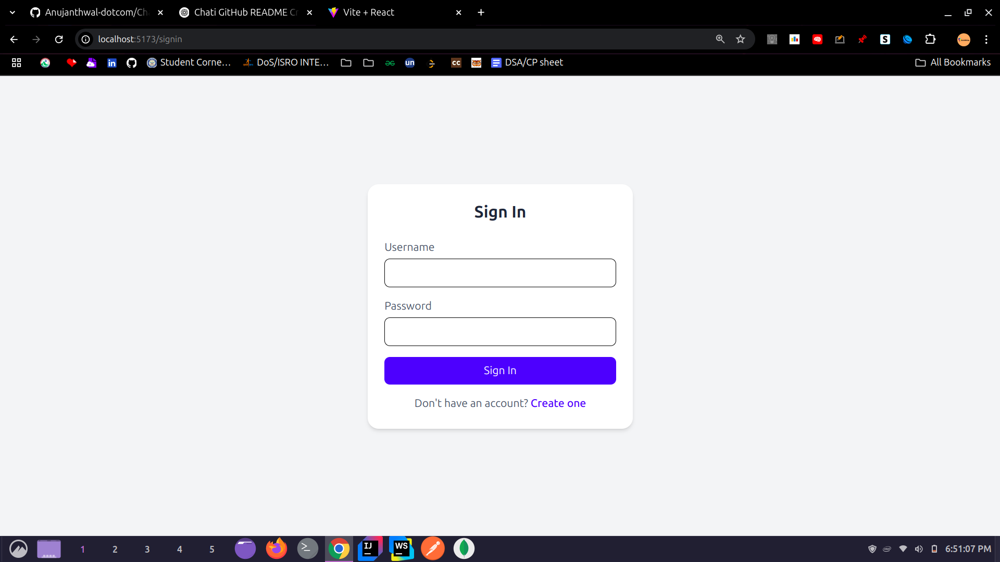
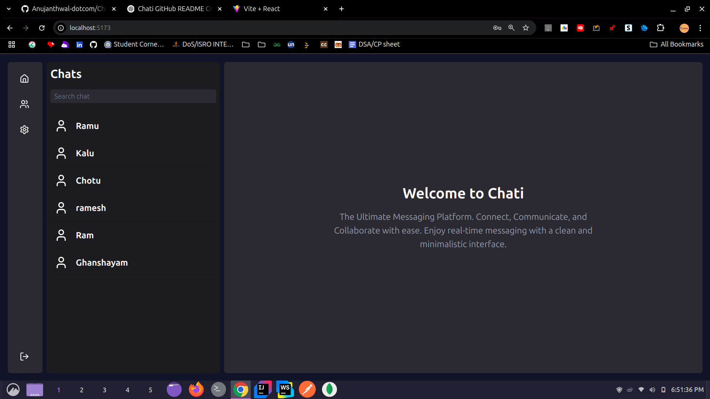

# ✨ Chati - Real-Time Chat Application

Chati is a full-stack real-time chat application built with a modern tech stack. It enables secure, smooth, and scalable communication with a clean and intuitive user interface.

---

## 🚀 Features

* Real-time messaging between users
* JWT-based authentication system
* Secure API access via Spring Security
* RESTful API architecture
* Scalable MongoDB integration
* Beautiful UI with Tailwind CSS and MUI
* State management with Redux + Thunk
* Animated UI with Framer Motion
* Role-based access control
* Mobile-first, responsive design

---
## 🛠️ Tech Stack

### 🎨 Frontend
- **React** `19.0.0`
- **Redux** & **Redux Thunk**
- **Tailwind CSS** `4.1.2`
- **Material UI (MUI)** `7.0.1`
- **Emotion (React + Styled)** `11.14.0`
- **Framer Motion** `12.6.3`
- **Axios** `1.8.4`
- **React Icons** `5.5.0`
- **Lucide React** `0.487.0`
- **React Router DOM** `7.4.1`

### ⚙️ Backend
- **Spring Boot** (Java 21)
- **Spring Security**
- **JWT Authentication**
- **MongoDB**
- **RESTful API Design**


---

## 📄 Getting Started

### Prerequisites

* Java 21
* Node.js v18+
* MongoDB (local or cloud)
* Maven

### 📂 Clone the Repository

```bash
git clone https://github.com/Anujanthwal-dotcom/Chati.git
cd Chati
```

---

### 🔧 Backend Setup (Spring Boot)

1. Navigate to backend folder:

```bash
cd backend
```

2. Configure `application.properties` in `src/main/resources`:

```properties
spring.data.mongodb.uri=your_mongodb_connection_uri
jwt.secret=your_jwt_secret_key
```

3. Run the backend:

```bash
./mvnw spring-boot:run
```

*Backend will run on:* `http://localhost:8080`

---

### 🎨 Frontend Setup (React)

1. Navigate to frontend:

```bash
cd frontend
```

2. Install dependencies:

```bash
npm install
```

3. Create a `.env` file:

```env
VITE_API_BASE_URL=http://localhost:8080/api
```

4. Start the development server:

```bash
npm run dev
```

*Frontend will run on:* `http://localhost:5173`

---

## 📁 Folder Structure

```
Chati/
├── backend/         # Spring Boot backend
│   └── src/
├── frontend/        # React frontend
│   └── src/
└── README.md
```

---

## 📸 Screenshots

> Add screenshots or GIFs below to showcase the UI:
>
> 
> 

---

## 👍 Contributing

* Fork the repo
* Create a feature branch: `git checkout -b feature/my-feature`
* Commit your changes: `git commit -m "Add my feature"`
* Push to the branch: `git push origin feature/my-feature`
* Open a Pull Request

---

